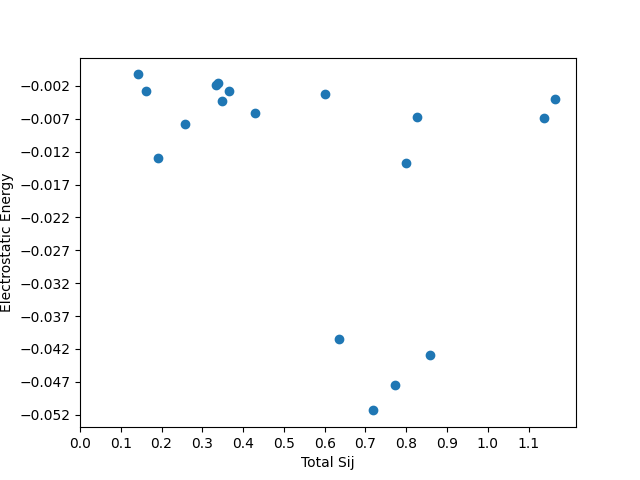
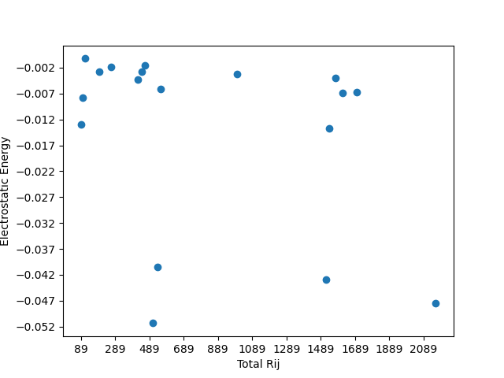
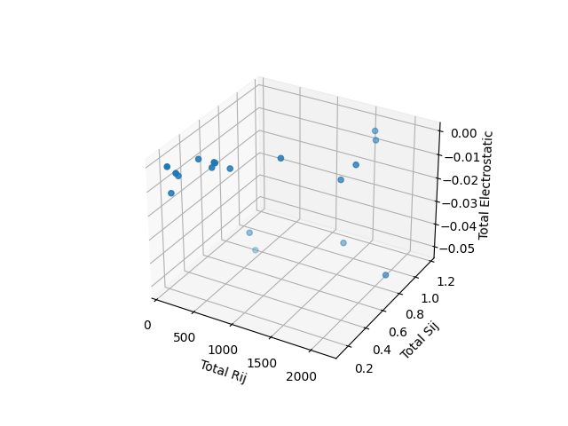

# S22 Dataset Electrostatic Energy Visualizations

Here are some experimental visualizations, done to explore whether there was any obvious structure to this data. The problem we face is that the functions we wish to learn depend on a series of variables $S_{ij}$ and $R_{ij}$. These are dependent on the distances and intermolecular overlap integrals of the molecules in each simulation in the S22 dataset. More precisely, we have:

$S_{ij}$: Intermolecular overlap integral between localized molecular orbitals i and j.

$R_{ij}$ : The distance between centroids of LMOs i and j.

Therefore, the amount of $S_{ij}$ and $R_{ij}$ values vary greatly from one output file to another, with the smallest file having 32 of these, and the largest having 882. If we were to train a model on all of these values, we would end up with samples of different dimensionality. One option would be to pad the smaller sample with zeroes. Another option would be to consider the sums of these $S_ij$ and $R_ij$ values as single features for each file. We could then attempt to discover a relationship dependent on this sum. This would greatly reduce the dimensionality of the data, but the relevance of this from a chemistry point of view remains uncertain. I produced some visualizations to explore this, mostly out of curiosity, which I present here as a means of record-keeping.

## Sum of $S_{ij}$ values vs total electrostatic energy (hartree)
 

## Sum of $R_{ij}$ values vs total electrostatic energy (hartree)

## Sum of $S_{ij}$ values and sum of $R_{ij}$ values vs total electrostatic energy (hartree)

